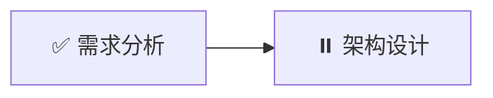

# Agent DAG 可视化增强功能

## 📋 功能概述

Agent DAG（有向无环图）可视化增强功能提供了任务依赖关系的全面分析和可视化展示，帮助团队更好地理解和优化多 Agent 协作流程。

### ✨ 核心功能

1. **关键路径分析** - 自动识别影响整体进度的关键任务链
2. **瓶颈检测** - 发现可能阻塞整个工作流的瓶颈任务
3. **并行度计算** - 显示可以同时执行的任务组
4. **执行时间估算** - 基于关键路径预估总执行时长
5. **多格式导出** - 支持 DOT、Mermaid、JSON 格式导出

---

## 🎯 使用场景

### 场景 1: 任务规划阶段

在创建团队任务时，通过 DAG 视图可以：
- 直观看到任务之间的依赖关系
- 识别可以并行执行的任务
- 预估整体完成时间
- 发现潜在的瓶颈点

```typescript
// 示例：创建带有依赖关系的任务
const tasks = [
  { id: 't1', title: '需求分析', dependencies: [] },
  { id: 't2', title: '架构设计', dependencies: ['t1'] },
  { id: 't3', title: '前端开发', dependencies: ['t2'] },
  { id: 't4', title: '后端开发', dependencies: ['t2'] },
  { id: 't5', title: '集成测试', dependencies: ['t3', 't4'] },
]
```

### 场景 2: 执行监控阶段

在任务执行过程中，DAG 视图可以：
- 实时显示任务状态（待执行/进行中/已完成/被阻塞）
- 高亮显示关键路径上的任务
- 标记被阻塞的任务及其原因
- 提供执行进度统计

### 场景 3: 问题诊断阶段

当项目延期或遇到阻塞时：
- 查看瓶颈任务报告
- 分析关键路径是否合理
- 识别可以优化的依赖关系
- 导出分析报告供团队讨论

---

## 🔧 API 使用

### 基础用法

```typescript
import EnhancedDAGView from './components/team/EnhancedDAGView'

function MyComponent() {
  const { tasks, dag, validation } = useTeamStore()
  
  return (
    <EnhancedDAGView
      tasks={tasks}
      dag={dag}
      validation={validation}
      onEdit={(task) => console.log('Edit task:', task)}
    />
  )
}
```

### 高级分析

```typescript
import {
  analyzeDAG,
  detectBottlenecks,
  findParallelGroups,
  generateDAGSummary,
  exportToMermaid,
} from './utils/dagVisualization'

// 分析 DAG
const analysis = analyzeDAG(dag, tasks)
console.log('总任务数:', analysis.totalTasks)
console.log('最大并行度:', analysis.maxParallelism)
console.log('关键路径:', analysis.criticalPath)
console.log('预估时长:', analysis.estimatedTotalDuration, '分钟')

// 检测瓶颈
const bottlenecks = detectBottlenecks(dag)
bottlenecks.forEach(bottleneck => {
  console.log(`瓶颈: ${bottleneck.title} - ${bottleneck.reason}`)
})

// 生成报告
const report = generateDAGSummary(dag, tasks, analysis)
console.log(report)

// 导出为 Mermaid
const mermaidCode = exportToMermaid(dag, 'My Project DAG')
```

---

## 📊 分析指标说明

### 基本统计

| 指标 | 说明 | 用途 |
|------|------|------|
| **总任务数** | DAG 中的任务总数 | 了解项目规模 |
| **已完成** | 已完成的任务数量 | 跟踪进度 |
| **待执行** | 等待执行的任务数量 | 规划资源 |
| **被阻塞** | 因依赖未完成而阻塞的任务 | 识别问题 |

### 结构分析

| 指标 | 说明 | 用途 |
|------|------|------|
| **依赖深度** | DAG 的最大层数 | 评估复杂度 |
| **最大并行度** | 同一波次最多可执行的任务数 | 优化资源分配 |
| **平均并行度** | 总任务数 / 依赖深度 | 评估并行效率 |
| **关键路径长度** | 关键路径上的任务数 | 预估最短工期 |

### 时间估算

| 指标 | 说明 | 计算方式 |
|------|------|----------|
| **预估总时长** | 完成所有任务的预估时间 | 关键路径长度 × 平均任务时长 |
| **关键路径** | 影响总工期的最长路径 | 从根节点到叶节点的最长路径 |

---

## 🎨 可视化特性

### 节点样式

- **颜色编码**：根据任务状态显示不同颜色
  - 🟢 绿色：已完成
  - 🔵 蓝色：进行中
  - ⚪ 灰色：待执行
  - 🔴 红色：失败或被阻塞
  - 🟣 紫色边框：关键路径上的任务

- **优先级条**：左侧彩色条表示优先级
  - 红色：Critical
  - 橙色：High
  - 黄色：Medium
  - 绿色：Low

- **阻塞标记**：被阻塞的任务显示虚线边框和🔒图标

### 交互功能

- **悬停高亮**：鼠标悬停在节点上时，高亮显示其上下游依赖链
- **点击编辑**：点击节点打开任务编辑对话框
- **缩放和平移**：支持 SVG 原生缩放和平移（浏览器自带）

### 图例说明

```
┌─────────────────────────────────────┐
│ 图例                                 │
├─────────────────────────────────────┤
│ ─ ─ ─  绿色虚线边框：就绪可执行       │
│ ─ ─ ─  红色虚线边框：被阻塞           │
│ ████   蓝色背景：进行中               │
│ ████   绿色背景：已完成               │
│ ████   紫色边框：关键路径             │
└─────────────────────────────────────┘
```

---

## 📤 导出功能

### 导出格式

#### 1. Graphviz DOT 格式

适用于专业的图形可视化工具（如 Graphviz、PlantUML）


**使用方法**：
```bash
# 安装 Graphviz
brew install graphviz  # macOS
sudo apt-get install graphviz  # Linux

# 生成图片
dot -Tpng dag-export.dot -o dag.png
```

#### 2. Mermaid 格式

适用于 Markdown 文档和 GitHub



**使用方法**：
- 直接粘贴到支持 Mermaid 的 Markdown 编辑器
- GitHub README 中直接使用
- Notion、Obsidian 等笔记工具

#### 3. JSON 格式

包含完整的分析数据，适合程序化处理

```json
{
  "analysis": {
    "totalTasks": 10,
    "maxParallelism": 3,
    "criticalPath": ["t1", "t2", "t5"],
    "estimatedTotalDuration": 30
  },
  "nodes": [...],
  "bottlenecks": [...],
  "parallelGroups": [...]
}
```

**使用方法**：
- 导入到其他项目管理工具
- 进行自定义分析
- 生成定制化报告

---

## 🔍 高级功能

### 关键路径分析

**什么是关键路径？**

关键路径是 DAG 中最长的路径，决定了项目的最短完成时间。关键路径上的任何延迟都会直接影响整体工期。

**如何识别？**

系统会自动计算并高亮显示关键路径：
- 紫色边框标记关键路径上的任务
- 分析报告中显示完整的关键路径序列
- 提供关键路径长度和预估时长

**优化建议：**
- 优先保障关键路径上的任务资源
- 考虑将关键路径上的任务进一步拆分
- 寻找关键路径的并行化机会

### 瓶颈检测

**什么是瓶颈任务？**

瓶颈任务是那些被多个后续任务依赖的任务。如果瓶颈任务延迟，会影响大量后续任务。

**检测规则：**
- 依赖者数量 ≥ 3 的任务
- 被阻塞且影响后续任务的节点

**优化建议：**
- 提前启动瓶颈任务
- 为瓶颈任务分配更多资源
- 考虑拆分瓶颈任务以减少依赖

### 并行度分析

**什么是并行度？**

并行度表示在同一时间可以执行的任务数量。更高的并行度意味着更快的整体进度。

**分析方法：**
- 按执行波次（Wave）分组
- 计算每个波次的任务数量
- 找出最大并行度和平均并行度

**优化建议：**
- 调整任务依赖关系以提高并行度
- 在资源允许的情况下并行执行更多任务
- 识别串行化的瓶颈并优化

---

## 💡 最佳实践

### 1. 任务拆分原则

- **粒度适中**：每个任务应该在 1-4 小时内完成
- **依赖清晰**：明确定义任务的输入和输出
- **减少耦合**：尽量减少任务间的依赖关系

### 2. 依赖管理

- **避免循环依赖**：系统会检测并警告循环依赖
- **最小化依赖**：只添加必要的依赖关系
- **文档化依赖**：在任务描述中说明依赖原因

### 3. 并行优化

- **识别独立任务**：尽早开始不依赖其他任务的工作
- **平衡负载**：确保各并行波次的任务量相对均衡
- **预留缓冲**：在关键路径上预留一定的缓冲时间

### 4. 监控策略

- **定期检查**：每天查看 DAG 视图，跟踪进度
- **关注瓶颈**：重点关注被标记为瓶颈的任务
- **及时调整**：发现阻塞时及时调整任务分配

---

## 🛠️ 故障排查

### 问题 1: DAG 视图显示空白

**可能原因：**
- 没有任务数据
- DAG 计算失败

**解决方法：**
```typescript
// 检查任务数据
console.log('Tasks:', tasks.length)
console.log('DAG:', dag.length)

// 重新加载 DAG
await fetchTaskDAG(teamId)
```

### 问题 2: 检测到循环依赖

**症状：**
- 显示红色警告框
- 列出循环路径

**解决方法：**
1. 查看警告信息中的循环路径
2. 找到形成循环的依赖关系
3. 移除或调整其中一个依赖
4. 重新验证 DAG

### 问题 3: 预估时长不准确

**原因：**
- 默认使用 10 分钟/任务的估算
- 未考虑任务实际复杂度

**改进方法：**
```typescript
// TODO: 未来版本将支持基于历史数据的智能估算
// 目前可以手动调整任务优先级和依赖关系来优化
```

### 问题 4: 导出的文件无法打开

**DOT 文件：**
- 确保安装了 Graphviz
- 使用正确的命令：`dot -Tpng file.dot -o file.png`

**Mermaid 文件：**
- 确保使用支持 Mermaid 的编辑器
- 检查语法是否正确

**JSON 文件：**
- 使用 JSON 查看器或编辑器
- 检查 JSON 格式是否有效

---

## 🚀 性能优化

### 大规模 DAG 处理

对于包含 50+ 任务的复杂项目：

1. **启用虚拟化**（未来版本）
   - 只渲染可见区域的节点
   - 减少 DOM 元素数量

2. **简化视图**
   - 折叠已完成的子图
   - 只显示关键路径

3. **分层加载**
   - 先加载概要信息
   - 按需加载详细信息

### 内存优化

```typescript
// 清理不再使用的分析数据
useEffect(() => {
  return () => {
    // 清理由 useMemo 缓存的大对象
  }
}, [teamId])
```

---

## 📈 未来改进方向

### 短期（1-2周）

1. **智能时间估算**
   - 基于历史数据学习任务时长
   - 考虑任务类型和复杂度

2. **资源约束分析**
   - 考虑可用 Agent 数量
   - 优化任务调度顺序

3. **实时进度追踪**
   - WebSocket 实时更新
   - 动画显示任务状态变化

### 中期（1-2月）

1. **交互式布局优化**
   - 拖拽调整节点位置
   - 自动布局算法优化

2. **多维度分析**
   - 成本分析
   - 风险评估
   - 质量指标

3. **协作功能**
   - 多人同时查看和编辑
   - 评论和批注

### 长期（3-6月）

1. **AI 辅助优化**
   - 自动识别优化机会
   - 智能推荐任务拆分方案

2. **预测性分析**
   - 预测延期风险
   - 提前预警潜在问题

3. **集成外部工具**
   - Jira、GitHub Projects 同步
   - CI/CD 流水线集成

---

## 📚 相关资源

### 技术文档

- [DAG 可视化算法](https://en.wikipedia.org/wiki/Directed_acyclic_graph)
- [Graphviz 官方文档](https://graphviz.org/documentation/)
- [Mermaid 语法指南](https://mermaid.js.org/intro/)

### 代码参考

- `src/renderer/utils/dagVisualization.ts` - 核心分析算法
- `src/renderer/components/team/EnhancedDAGView.tsx` - UI 组件
- `src/main/team/TeamRepository.ts` - DAG 计算逻辑

### 示例项目

查看项目中的示例团队配置，了解如何设置复杂的任务依赖关系。

---

**最后更新**: 2026-04-30  
**版本**: 1.0  
**维护者**: AI Assistant
